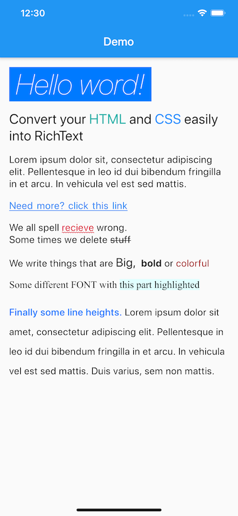

# Simple Html CSS

[](https://pub.dev/packages/simple_html_css) [](https://github.com/ali-thowfeek/simple_html_css_flutter/blob/master/LICENSE)

This is a fork of [css_text_for_flutter](https://github.com/hathibelagal-dev/css_text_for_flutter)

This package makes it easy for you to convert HTML and CSS text content
into `RichText` widgets. It supports most CSS properties that are
relevant to **text** content, except for a few. Also gives the ability to
override the styles of the content passed in.

>NOTE: This is not an alternative to webview packages. This package only deals with text.

Here's a sample HTML content with inline CSS styles:

```html
<body>
    <h1 style='color: white; font-size:50px; font-style:italic; 
    background-color: rgb(0,122,255); font-weight:100;)'> Hello word! </h1>
    <h1 style=''>Convert your <span style='color:lightseagreen;'>
    HTML</span> and <span style='color:dodgerblue'>CSS</span> 
    easily into RichText</h1>
    <p>Lorem ipsum dolor sit, consectetur adipiscing elit. Pellentesque in leo 
    id dui bibendum fringilla in et arcu. In vehicula vel est sed mattis.</p>
    <p><a href="https://google.com">Need more? click this link</a></p>
    <p>We all spell <span style='color:crimson; 
    text-decoration: underline wavy;'>recieve</span> wrong.<br />Some times we 
    delete <del>stuff</del></p>
    <div style='font-size:17px'>We write things that are 
    <span style='font-size:1.5em;'>Big,</span> <b>bold</b>&nbsp; or 
    <span style='color:brown'>colorful</span></div>
    <p style='font-family:times;'>Some different FONT with 
    <span style='background-color:lightcyan;'>this part highlighted</span></p>
    <div style='line-height:2; font-size:17px;'><b style='color: rgb(0,122,255); 
    font-weight:500;'>Finally some line heights.</b> Lorem ipsum dolor sit amet, 
    consectetur adipiscing elit. Pellentesque in leo id dui bibendum fringilla 
    in et arcu. In vehicula vel est sed mattis. Duis varius, sem non mattis.</div>
</body>
```

This package can automatically convert all the HTML content above into
`TextSpan` objects or a `RichText` widget. Here's what the render will look like:



## Getting Started

Using `simple_html_css` is extremely easy. First import the library in
your Dart code:

```
import 'package:simple_html_css/simple_html_css.dart';
```

You can then create `TextSpan` from any HTML content by calling the `HTML.toTextSpan()` method. Which you can use to create a `RichText` widget.

```dart
String htmlContent = """
<p style="font-size:1.5em;">Hello World</p>
""";

RichText(
  text: HTML.toTextSpan(context, htmlContent),
  maxLines: 4,
  //...
  );
```

As a shortcut, you can also use the `HTML.toRichText()` method.

```dart
var myRichText = HTML.toRichText(context, htmlContent);

Container(
  child: myRichText,
);
```

## Handling Links

Your HTML content can have links. To handle them, you must use the
`linksCallback` optional parameter.

```dart
String htmlContent = """<span style="font-size:2em">
Please click <a href="https://pub.dartlang.org">here</a> or 
<a href="https://old.reddit.com">here</a>.<br/>
<br/>
Go ahead! Try it.
</span>""";

var myRichText = HTML.toRichText(context, htmlContent, linksCallback: (link) {
    // You can now use the url_launcher library to open the link.
    // Or you can handle the link in your app itself. This gives you
    // complete control over your links.
    // For now, let's just print it
    print(link);
});
```

## Overriding styles

You can override the inline styles and apply global styles for all the  
HTML tags in your HTML content.

```dart
String htmlContent =
   """
   <p>This has no font size css property, but global style will be applied</p>
   <a style='color: orange;'>The inline color for this is orange, but it will 
   get overridden by global style defined below</a>
   """;

HTML.toTextSpan(
      context,
      htmlContent,
      overrideStyle: {
        "p": TextStyle(fontSize: 17.3),
        "a": TextStyle(color: Colors.red),
        // specify any tag not just the supported ones,
        // and apply TextStyles to them and/override them
      },
    );
```

## Supported HTML Tags

Supports all tags which prints text normally like `p`, `div`, `span`, `body` etc.  
And the following special tags which change the text appearance
* `<h1> - <h5>`
* `<b>` `<strong>`
* `<i>` `<em>`
* `<u>`
* `<strike>` `<del>` `<s>`
* `<a>` - anchor tags with link click `callback`

## Supported CSS properties (text related)

| supported Css property | supported value(s)                                                                                                            |
|:-----------------------|:------------------------------------------------------------------------------------------------------------------------------|
| font-weight            | `100 to 900`, `normal`, `medium`, `bold`                                                                                      |
| color                  | css color name like: `red`, `orangered` etc. or `rgb(0, 0, 255)` or `rgba(0, 0, 50, 0.5)` or Hex `#eee`/`#ff00ff`/`#ff005522` |
| background-color       | same as above                                                                                                                 |
| font-style             | `italic` and `normal`                                                                                                         |
| font-family            | any valid font family. eg: `times`                                                                                            |
| font-size              | eg: `18px` or `1.5em`                                                                                                         |
| text-decoration        | `underline`, `overline`, `none`, `line`, `dotted`, `dashed`, `wavy`                                                           |
| line-height            | any valid value. eg: `1.5`                                                                                                    |

## Partially supported HTML tags

`<ol>` `<ul>` `<li>`
These tags will be rendered on new lines, but without the number or symbol

## Workaround for text not rendering properly


If you experienced any rendering issue like this,
It is becuase you need to have the build `context` of a Material parent
Widget such as a `Scaffold` or `Material`.

To get the context directly a quick workaround is adding a `Builder`

```dart
Scaffold(
  body: Builder(
    builder: (context) {
        return RichText(
          text: HTML.toTextSpan(context, htmlContent),
      );
    },
  ),
)
```
